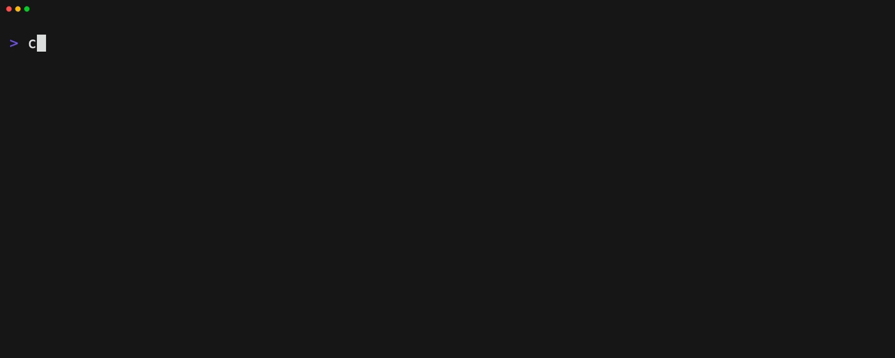

# cnip - Command-line Snippet CLI Manager

cnip manages shell command snippets from the command line.



## Install

```bash
$ npm i -g cnip-snippet
```

## Usage

```
USAGE:
    cnip [COMMAND]

AVAILABLE COMMANDS:
    list                     Show all snippets
    add                      Add a new snippet
    edit                     Edit snippet
    del                      Delete snippet
    import                   Import snippets
    sync                     Sync snippets
    version                  Print version

OPTIONS:
    -c                       Copy selected command to clipboard
    --snippet [STRING]       snippet file (default is $HOME/./config/cnip/snippet.json)
    --input [STRING]         Reads the specified text file into the command list (e.g. $HISTFILE, etc.)
    --tag [STRING]           Specify the tag to be selected for initial display
    --select [STRING]        Display aliases and commands that match the specified text
    --pet-snippet [STRING]   Read Pet snippet file
    -h                       Print Help
```

## Features

- Store shell command snippets
- Fuzzy search with edit, delete and clipboard copy
- Tag-based organization
- Import from shell history, Pet snippets, and Navi cheatsheets
- GitHub Gist synchronization

### Shell commands

#### bash

```bash
function cmd-select() {
  if [ "$READLINE_LINE" = "" ]; then
    BUFFER=$(cnip --input $HISTFILE -s usage-count --query "$READLINE_LINE")
  else
    BUFFER=$(cnip --input $HISTFILE -s usage-count)
  fi
  READLINE_LINE="$BUFFER"
  READLINE_POINT=${#BUFFER}
}
bind -x '"\C-r": cmd-select'
```

#### zsh

```bash
function cmd-select() {
  if [[ "$LBUFFER" == "" ]] then
    BUFFER=$(cnip --input "$HISTFILE" -s "usage-count")
  else
    BUFFER=$(cnip --input "$HISTFILE" -s "usage-count" --query "$LBUFFER")
  fi

  CURSOR=$#BUFFER
  zle redisplay
}

function cmd-expand() {
  if [[ "$LBUFFER" != "" ]] then
    BUFFER=$(cnip --select "$LBUFFER")
  fi

  CURSOR=$#BUFFER
  zle redisplay
}

zle -N cmd-select
zle -N cmd-expand
bindkey '^r' cmd-select
bindkey '^e' cmd-expand
```

### Sync to Gist

Requires a GitHub access token with "gist" scope.

Set the `CNIP_GITHUB_GIST_ACCESS_TOKEN` environment variable to your token.

## Customization

Configure display colors with these environment variables:

```bash
CNIP_HIGHLIGHT_COLOR="#FFBC00"
CNIP_CURRENT_LINE_COLOR="#FFBC00"
CNIP_PROMPT_COLOR="#6E4BEC"
CNIP_TEXT_COLOR="#D4D7DC"
CNIP_SELECTED_COLOR="#008000"
CNIP_SELECTED_TAB_COLOR="#6E4BEC"
CNIP_TAB_COLOR="#A9A9A9"
CNIP_POINTER_COLOR="#6E4BEC"
CNIP_BORDER_COLOR="#ADADAD"
CNIP_DESCRIPTION_COLOR="#3BBFBF"
CNIP_CURRENT_LINE_COLOR="#6E4BEC"
CNIP_SHOW_ICONS="1"
```

## Build

- Build: `npm run build`
- Clean: `npm run clean`
- Build & watch: `npm run dev`

## Run

```sh
node src/Index.bs.js
```

## License

MIT
